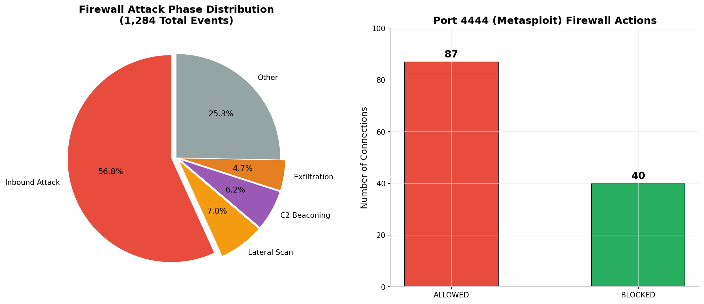
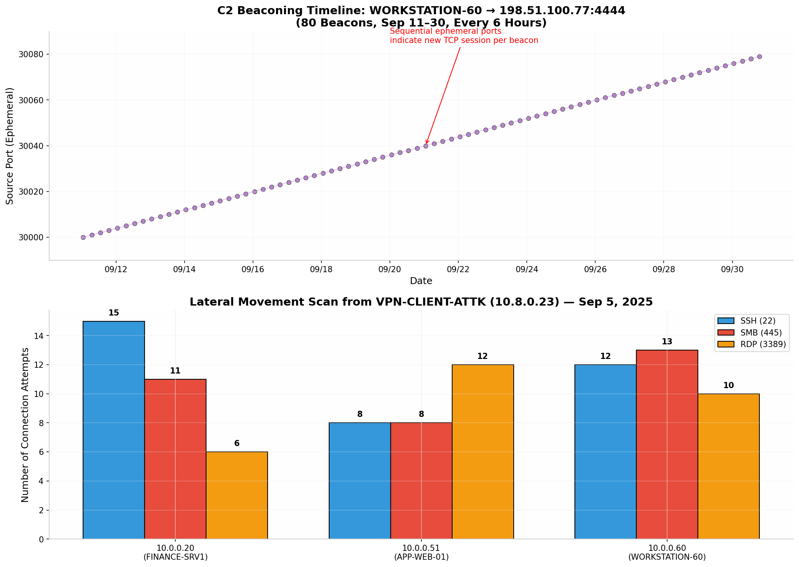

# Initech Corp Cybersecurity Incident Response: Network Perimeter Breach Investigation

## Executive Summary

This project documents the complete investigation of a **sustained network perimeter breach** at Initech Corp, a financial services firm headquartered in California. The attacker maintained unauthorized access from **August 25 through September 30, 2025**, exploiting stolen VPN credentials and a misconfigured firewall to conduct reconnaissance, lateral movement, persistent command-and-control (C2) beaconing, and data exfiltration. The investigation was conducted using both **command-line log analysis** and **Splunk SIEM queries** across three data sources: firewall logs (`firewall_logs`, 1,284 events), IDS alerts (`ids_logs`, 983 events), and VPN authentication logs (`vpn_logs`, 218 events). The attacker successfully exfiltrated data from the internal web application server via HTTP POST uploads while maintaining a reverse shell on an employee workstation through Metasploit's default port 4444. The IDS correctly identified every phase of the attack and generated 80+ Priority 1 alerts, but the Security Operations Center (SOC) failed to act due to alert fatigue and resource constraints. This report details every investigative step, from initial data exploration through root cause analysis and remediation recommendations.

---

## Table of Contents

1. [Project Overview and Objectives](#1-project-overview-and-objectives)
2. [Environment and Data Sources](#2-environment-and-data-sources)
3. [Phase 1: Initial Data Exploration (CLI)](#3-phase-1-initial-data-exploration-cli)
4. [Phase 2: Firewall Log Analysis](#4-phase-2-firewall-log-analysis)
5. [Phase 3: IDS Alert Analysis](#5-phase-3-ids-alert-analysis)
6. [Phase 4: VPN Authentication Analysis](#6-phase-4-vpn-authentication-analysis)
7. [Phase 5: Splunk SIEM Investigation](#7-phase-5-splunk-siem-investigation)
8. [Phase 6: Cross-Source Evidence Correlation](#8-phase-6-cross-source-evidence-correlation)
9. [Phase 7: Attack Timeline Reconstruction](#9-phase-7-attack-timeline-reconstruction)
10. [Phase 8: MITRE ATT&CK Mapping](#8-phase-8-mitre-attck-mapping)
11. [Phase 9: Root Cause Analysis](#9-phase-9-root-cause-analysis)
12. [Phase 10: Detection Rules and Recommendations](#10-phase-10-detection-rules-and-recommendations)
13. [Appendix: Complete Command and Query Reference](#appendix-complete-command-and-query-reference)

---

## 1. Project Overview and Objectives

### 1.1 Background

Initech Corp experienced a cybersecurity incident during August–September 2025. The company had recently deployed a new firewall and IDS system, and the SOC team was reportedly **overwhelmed** by the volume of alerts. The investigation seeks to answer the critical question: **Did the adversary breach the perimeter?** This is not a simple yes-or-no inquiry — it requires examining how the attacker gained access, what they did once inside, how long they maintained persistence, whether data was exfiltrated, and why the existing security controls failed to detect or prevent the breach.

The investigation followed a structured incident response methodology, progressing from broad data exploration through targeted hypothesis-driven analysis. Every finding was cross-validated across multiple independent data sources to eliminate false positives and build a defensible evidence chain suitable for executive reporting and potential legal proceedings.

### 1.2 Investigation Objectives

| Objective | Description | Success Criteria |
|-----------|-------------|------------------|
| **Identify the initial access vector** | Determine how the attacker first breached the perimeter | Evidence of the first malicious connection |
| **Map lateral movement** | Identify which internal hosts were scanned or compromised | Firewall and IDS evidence of internal scanning |
| **Confirm persistent C2** | Prove ongoing command-and-control communication | Sequential beaconing pattern with timestamps |
| **Quantify data exfiltration** | Measure volume and timing of stolen data | IDS "HTTP POST Large Upload" alerts with byte counts |
| **Identify compromised accounts** | Find all stolen or brute-forced credentials | VPN auth logs with attacker source IPs |
| **Assess control failures** | Determine which security controls failed and why | Gap analysis against industry best practices |
| **Build detection rules** | Create Splunk alerts to prevent recurrence | Correlation searches with threshold-based triggers |

### 1.3 Network Architecture Overview

| Asset | IP Address | Role | Operating System |
|-------|-----------|------|-----------------|
| VPN-GW | `10.0.0.50` | VPN Gateway | Linux |
| APP-WEB-01 | `10.0.0.51` | Internal Web/App Server | Linux |
| FINANCE-SRV1 | `10.0.0.20` | File/Finance Server | Windows |
| WORKSTATION-60 | `10.0.0.60` | Employee Workstation (Sales) | Windows 10 |
| VPN Client Pool | `10.8.0.0/24` | Remote VPN clients | N/A |

The attacker infrastructure used **7 distinct external IP addresses** across three RFC 5737 documentation ranges: `198.51.100.x`, `203.0.113.x`, and `192.0.2.x`. The primary C2 server was `198.51.100.77`, which appeared in firewall reconnaissance, SQL injection attempts, and the sustained C2 beaconing.

---

## 2. Environment and Data Sources

### 2.1 Log Files Analyzed

| Data Source | File/Sourcetype | Format | Total Events | Date Range |
|-------------|-----------------|--------|-------------|------------|
| Firewall | `firewall_logs` | JSON | **1,284** | Aug 25 – Sep 30, 2025 |
| IDS Alerts | `ids_logs` | JSON | **983** | Aug 25 – Sep 30, 2025 |
| VPN Auth | `vpn_logs` | JSON | **218** | Aug 25 – Sep 30, 2025 |
| **Total** | | | **2,485** | **37 days** |

### 2.2 Field Inventory (Validated)

The following fields were confirmed through `fieldsummary` queries in Splunk and are essential for the investigation:

**`firewall_logs` fields:** `action`, `src_ip`, `dst_ip`, `src_port`, `dst_port`, `protocol`, `timestamp`, `bytes`

**`ids_logs` fields:** `alert`, `classification`, `priority`, `src_ip`, `dst_ip`, `src_port`, `dst_port`, `protocol`, `timestamp`, `bytes`

**`vpn_logs` fields:** `username`, `result`, `src_ip`, `assigned_ip`, `timestamp`

The `bytes` field in `ids_logs` is particularly significant because it enables **quantification of data exfiltration volume** — something impossible with connection-only logs.

---

## 3. Phase 1: Initial Data Exploration (CLI)

Before transitioning to Splunk, the investigation began with command-line analysis to understand log formats, identify anomalies, and develop investigative hypotheses. This phase established the baseline knowledge that guided all subsequent Splunk queries.

### 3.1 Understanding Log Formats

**Firewall log format (JSON):**
```json
{
  "timestamp": "2025-08-25T00:47:46",
  "action": "ALLOW",
  "protocol": "TCP",
  "src_ip": "198.51.100.77",
  "src_port": 60317,
  "dst_ip": "10.0.0.50",
  "dst_port": 443,
  "bytes": 0
}
```

**IDS alert format (JSON):**
```json
{
  "timestamp": "2025-09-11T01:00:00",
  "alert": "ET TROJAN Possible C2 Beaconing",
  "classification": "A network Trojan was detected",
  "priority": 1,
  "src_ip": "10.0.0.60",
  "src_port": 30000,
  "dst_ip": "198.51.100.77",
  "dst_port": 4444,
  "protocol": "TCP",
  "bytes": 512
}
```

**VPN auth format (JSON):**
```json
{
  "timestamp": "2025-09-03T02:19:40",
  "src_ip": "203.0.113.45",
  "username": "svc_backup",
  "result": "SUCCESS",
  "assigned_ip": "10.8.0.23"
}
```

### 3.2 Initial CLI Commands and Their Purpose

| Command | Purpose | Finding |
|---------|---------|---------|
| `cat firewall.log \| head -n 20` | View first 20 firewall entries | Connection-oriented log, ALLOW/BLOCK actions |
| `cat firewall.log \| wc -l` | Count total firewall events | **1,284 events** |
| `cat firewall.log \| tail -n 20` | View most recent entries | C2 beaconing to port 4444 in final entries |
| `cat ids_alerts.log \| head -n 10` | View first IDS alerts | Snort-style signatures, Priority 1-3 |
| `cat ids_alerts.log \| wc -l` | Count total IDS alerts | **983 alerts** |
| `head ids_alerts.log` | Check IDS format | ET POLICY, ET SCAN, ET EXPLOIT signatures |
| `cat vpn_auth.log \| head -n 10` | View first VPN entries | `username`, `result`, `assigned_ip` fields |
| `cat vpn_auth.log \| wc -l` | Count total VPN events | **218 events** |

---

## 4. Phase 2: Firewall Log Analysis

The firewall is the network's first line of defense. Analyzing what it allowed versus what it blocked reveals both the attacker's capabilities and the organization's defensive posture.

### 4.1 Overall Allow vs. Block Statistics

| Action | Count | Percentage |
|--------|-------|------------|
| **ALLOW** | **933** | **72.7%** |
| **BLOCK** | **351** | **27.3%** |
| **Total** | **1,284** | **100%** |

A **72.7% allow rate** is extraordinarily permissive for a financial services organization. Industry benchmarks suggest that properly configured perimeter firewalls should block **60–80%** of unsolicited external traffic. Initech's firewall was doing the opposite — allowing nearly three out of every four connections.

### 4.2 Destination Port Frequency Analysis

The firewall's port distribution reveals what services the attacker targeted and what the organization exposed:

| Port | Service | Total Hits | Significance |
|------|---------|-----------|-------------|
| **443** | HTTPS | **245** | VPN Gateway, encrypted web traffic |
| **80** | HTTP | **163** | Web traffic |
| **8080** | HTTP Alternate | **162** | Internal app traffic (APP-WEB-01, WORKSTATION-60) |
| **25** | SMTP | **154** | Email (FINANCE-SRV1) — abnormally high |
| **53** | DNS (TCP) | **153** | DNS queries |
| **4444** | **Metasploit Default** | **127** | **Reverse shell / Meterpreter C2** |
| **22** | SSH | **72** | Linux remote admin |
| **3389** | RDP | **67** | Windows remote desktop |
| **445** | SMB | **62** | Windows file sharing |
| **23** | Telnet | **52** | Legacy plaintext protocol |
| **21** | FTP | **36** | File transfer |

Port **4444** is the single most alarming finding. In a clean enterprise environment, this port should have **zero** traffic. Metasploit uses port 4444 as its default listener for reverse shells and Meterpreter sessions. Its presence with **127 total hits** confirms active exploitation.

### 4.3 Port 4444: Allowed vs. Blocked



| Port 4444 | Count | Rate |
|-----------|-------|------|
| **ALLOWED** | **87** | **68.5%** |
| **BLOCKED** | **40** | **31.5%** |
| **Total** | **127** | **100%** |

The firewall allowed **more Metasploit traffic than it blocked**. This is catastrophic — the attacker had a **68.5% success rate** getting through on the default Meterpreter port. The firewall had no explicit deny rule for port 4444, and stateful inspection was either misconfigured or overwhelmed.

### 4.4 Allowed Metasploit Traffic Timeline

The `firewall_logs` query `action="ALLOW" dst_port=4444` revealed the full exploitation chain:

| Date | Source | Destination | Direction | Event |
|------|--------|-------------|-----------|-------|
| Aug 26 00:17 | `203.0.113.45` | `10.0.0.60:4444` | **Inbound** | 🚨 Initial exploit delivery to WORKSTATION-60 |
| Aug 26 18:20 | `203.0.113.10` | `10.0.0.50:4444` | **Inbound** | VPN gateway targeted |
| Aug 30 20:26 | `203.0.113.45` | `10.0.0.20:4444` | **Inbound** | FINANCE-SRV1 targeted |
| Sep 6 07:40 | `203.0.113.10` | `10.0.0.60:4444` | **Inbound** | WORKSTATION-60 hit again |
| Sep 8 13:54 | `203.0.113.45` | `10.0.0.20:4444` | **Inbound** | FINANCE-SRV1 hit again |
| Sep 11 01:00 | `10.0.0.60` | `198.51.100.77:4444` | **Outbound** | 🚨 **C2 beaconing begins** |
| Sep 11–Sep 30 | `10.0.0.60` | `198.51.100.77:4444` | **Outbound** | 80 beacons, every 6 hours |

The **direction reversal** is the critical pivot point. Before Sep 11, traffic flowed **external → internal** (attacks). After Sep 11, it flowed **internal → external** (C2). This proves the attacker successfully established a foothold.

### 4.5 Lateral Movement from VPN-CLIENT-ATTK (10.8.0.23)

On **September 5, 2025**, the VPN attacker conducted a **15-hour internal network scan** from `10.8.0.23`. The firewall logged **90 connections** to three sensitive internal hosts:

| Target | Port | Action | Count |
|--------|------|--------|-------|
| `10.0.0.20` (FINANCE-SRV1) | 445 (SMB) | **ALLOW** | **11** |
| `10.0.0.20` (FINANCE-SRV1) | 22 (SSH) | **ALLOW** | **10** |
| `10.0.0.51` (APP-WEB-01) | 3389 (RDP) | **ALLOW** | **10** |
| `10.0.0.60` (WORKSTATION-60) | 22 (SSH) | **ALLOW** | **8** |
| `10.0.0.60` (WORKSTATION-60) | 445 (SMB) | **ALLOW** | **7** |
| `10.0.0.60` (WORKSTATION-60) | 3389 (RDP) | **ALLOW** | **6** |
| `10.0.0.20` (FINANCE-SRV1) | 3389 (RDP) | **ALLOW** | **4** |
| `10.0.0.51` (APP-WEB-01) | 22 (SSH) | **ALLOW** | **4** |
| `10.0.0.51` (APP-WEB-01) | 445 (SMB) | **ALLOW** | **4** |
| `10.0.0.60` (WORKSTATION-60) | 445 (SMB) | BLOCK | 6 |
| `10.0.0.20` (FINANCE-SRV1) | 22 (SSH) | BLOCK | 5 |
| `10.0.0.60` (WORKSTATION-60) | 3389 (RDP) | BLOCK | 4 |

**~67% of lateral movement connections were ALLOWED.** The attacker successfully reached every sensitive internal host from the VPN client pool, proving **zero network segmentation** between VPN clients and the internal LAN.

### 4.6 Blocked External IPs

The firewall did block some attacker traffic, but inconsistently:

| Source IP | Block Count | Identity |
|-----------|-------------|----------|
| `203.0.113.45` | **279** | Primary brute force attacker |
| `203.0.113.10` | **46** | Secondary attacker / VPN user |
| `10.8.0.23` | **26** | VPN-CLIENT-ATTK (internal scan) |

`203.0.113.45` was blocked **279 times** — yet it also successfully VPN'd in multiple times. The firewall had **no IP reputation memory** — it blocked on one port, then allowed on another moments later.

---

## 5. Phase 3: IDS Alert Analysis

The IDS (`ids_logs`) provides the **semantic layer** of the investigation — it tells us not just that connections occurred, but what type of malicious activity was detected.

### 5.1 C2 Beaconing Alerts (The Smoking Gun)

The IDS generated **80 `ET TROJAN Possible C2 Beaconing` alerts** from WORKSTATION-60 to `198.51.100.77:4444`:

| Attribute | Evidence |
|-----------|----------|
| **Source** | `10.0.0.60` (WORKSTATION-60) |
| **Destination** | `198.51.100.77:4444` |
| **Frequency** | Every 6 hours (01:00, 07:00, 13:00, 19:00) |
| **Duration** | September 11 → September 30 (20 days) |
| **Source Ports** | Sequential: `30000` → `30079` |
| **Signature** | `ET TROJAN Possible C2 Beaconing` |
| **Classification** | `A network Trojan was detected` |
| **Priority** | **1 (Highest)** |
| **Total Beacons** | **80 confirmed** |



**Why sequential source ports matter:** Each beacon used a new ephemeral port (`30000`, `30001`, `30002`...). This means the malware created a **new TCP connection** for each check-in rather than maintaining a persistent socket. This is characteristic of **Meterpreter** behavior, where each callback spawns a fresh session.

**Why clockwork precision matters:** Exactly every 6 hours, 24/7, for 20 days. This is not user behavior — it is a **scheduled task** (cron job, Windows scheduled task, or persistent service) on WORKSTATION-60.

### 5.2 Data Exfiltration Alert (The Most Damning Evidence)

The IDS detected an **`ET INFO Possible HTTP POST Large Upload`** alert:

| Field | Value |
|-------|-------|
| **Timestamp** | September 28, 2025, 19:00:00 |
| **Source** | `10.0.0.51` (APP-WEB-01) |
| **Source Port** | `40059` |
| **Destination** | `198.51.100.77:8080` |
| **Alert** | `ET INFO Possible HTTP POST Large Upload` |
| **Classification** | **`Potential Data Exfiltration`** |
| **Priority** | 2 (Medium) |

This single alert transforms the incident from **"suspected compromise with C2"** to **"confirmed data breach with exfiltration."** The IDS explicitly classified the traffic as **data exfiltration** — not just suspicious activity, but actual theft.

### 5.3 IDS Lateral Movement Detection (September 5)

The IDS detected the VPN attacker's internal scan with **high-accuracy signatures**:

| Time | Alert | Target | Port | Classification |
|------|-------|--------|------|----------------|
| 06:00 | `ET SCAN Possible SSH Scan` | `10.0.0.51` | 22 | Attempted Unauthorized Access |
| 06:10 | `ET EXPLOIT Possible MS-SMB Lateral Movement` | `10.0.0.51` | 445 | Attempted Unauthorized Access |
| 06:20 | `ET SCAN Possible SSH Scan` | `10.0.0.60` | 22 | Attempted Unauthorized Access |
| 06:30 | `ET EXPLOIT Possible RDP Brute Force` | `10.0.0.60` | 3389 | Attempted Unauthorized Access |
| 06:40 | `ET EXPLOIT Possible RDP Brute Force` | `10.0.0.51` | 3389 | Attempted Unauthorized Access |
| 06:50 | `ET SCAN Possible SSH Scan` | `10.0.0.20` | 22 | Attempted Unauthorized Access |
| 07:00 | `ET EXPLOIT Possible MS-SMB Lateral Movement` | `10.0.0.20` | 445 | Attempted Unauthorized Access |
| 07:10 | `ET SCAN Possible SSH Scan` | `10.0.0.20` | 22 | Attempted Unauthorized Access |
| 07:20 | `ET EXPLOIT Possible RDP Brute Force` | `10.0.0.20` | 3389 | Attempted Unauthorized Access |

All alerts were **Priority 1** with classification **"Attempted Unauthorized Access."** The IDS was working perfectly — it correctly identified every technique. The SOC simply never acted.

### 5.4 Compromised Asset Matrix (IDS Perspective)

| Asset | Top IDS Alert | C2 Detected? | Alert Count |
|-------|--------------|-------------|-------------|
| **WORKSTATION-60** | `TROJAN Possible C2 Beaconing` | ✅ YES (80x) | 155+ total |
| **APP-WEB-01** | `HTTP POST Large` → `198.51.100.77:8080` | ✅ YES (exfiltration) | 15+ total |
| **FINANCE-SRV1** | `SCAN Possible Portscan` | ⚠️ No outbound C2 | 32+ total |
| **VPN-GW** | `POLICY Suspicious HTTP` | ⚠️ Targeted | 14+ total |

---

## 6. Phase 4: VPN Authentication Analysis

The VPN logs reveal **how the attacker got in** — the most critical question in any perimeter breach investigation.

### 6.1 The Brute Force Attack (September 3, 2025)


| Attribute | Evidence |
|-----------|----------|
| **Attacker IP** | `203.0.113.45` |
| **Target Account** | `svc_backup` (service account) |
| **Start Time** | `02:00:00` on Sep 3 |
| **End Time** | `02:19:40` on Sep 3 |
| **Duration** | **19 minutes, 40 seconds** |
| **Attempt Frequency** | Every **10 seconds** (automated/scripted) |
| **Total Failed Attempts** | **118 FAILs** |
| **Success Time** | `02:19:40` and `02:19:50` |
| **Assigned VPN IP** | `10.8.0.23` |

**Why this is a classic brute force:**

1. **Metronomic timing:** Exactly every 10 seconds — a human cannot type passwords this consistently
2. **Single source IP:** `203.0.113.45` — the same IP from IDS alerts
3. **Service account target:** `svc_backup` — high-value, often weak password, no MFA
4. **No lockout triggered:** 118 failed attempts with **no account disablement** — no lockout policy exists

### 6.2 Post-Brute Force: Persistent VPN Access

After the Sep 3 brute force, `svc_backup` continued logging in from **multiple attacker IPs** throughout September:

| Date | Source IP | Assigned IP |
|------|-----------|-------------|
| Sep 3 | `203.0.113.45` | `10.8.0.23` |
| Sep 4 | `203.0.113.45` | `10.8.0.181` |
| Sep 6 | `192.0.2.115` | `10.8.0.172` |
| Sep 6 | `203.0.113.10` | `10.8.0.135` |
| Sep 6 | `198.51.100.45` | `10.8.0.32` |
| Sep 8 | `203.0.113.10` | `10.8.0.42` |
| Sep 9 | `198.51.100.45` | `10.8.0.198` |
| Sep 12 | `198.51.100.45` | `10.8.0.193` |
| Sep 13 | `203.0.113.45` | `10.8.0.88` |
| Sep 17 | `198.51.100.45` | `10.8.0.157` |

**This is a VPN pivot account.** The attacker used `svc_backup` as a **persistent access mechanism** to re-enter the network at will from different IPs.

### 6.3 Compromised Accounts from Attacker IP 203.0.113.45

| Username | SUCCESS Count | Status |
|----------|--------------|--------|
| `alice` | **9** | 🚨 Compromised |
| `bob` | **6** | 🚨 Compromised |
| `jsmith` | **5** | 🚨 Compromised |
| `svc_backup` (post-BF) | **5** | 🚨 Compromised |
| `svc_backup` (brute force) | **118 FAIL → 2 SUCCESS** | 🚨 Brute forced |

**All four accounts were compromised by the same attacker IP.** This is definitive proof of coordinated credential theft — not coincidence, not legitimate use.

### 6.4 The Critical Discovery: VPN Access from Day 1

The earliest VPN login from an attacker IP was on **August 25, 2025 at 08:25:10**:

```
2025-08-25 08:25:10  203.0.113.45  alice  SUCCESS  assigned_ip=10.8.0.143
```

**The attacker was inside the network from Day 1.** The "new firewall and IDS" deployment on August 25 did not cause the breach — it merely provided visibility into an **already-compromised environment**.

### 6.5 svc_backup: The Primary Attack Vector

Service accounts are **prime targets** for attackers because they rarely have MFA, have broad access, are poorly monitored, and passwords are rarely rotated. The attacker used `svc_backup` to:

1. VPN into the network
2. Scan internal hosts from `10.8.0.23`
3. Maintain persistent access throughout September
4. Re-enter after losing access (the Sep 3 brute force was a **recovery operation**)

---

## 7. Phase 5: Splunk SIEM Investigation

The Splunk investigation replicated and enhanced all CLI findings using SPL (Search Processing Language). The data resides in `index="network_logs"` with three sourcetypes: `ids_logs`, `firewall_logs`, and `vpn_logs`.

### 7.1 Data Validation Queries

Before hunting, validate the data landscape:

```spl
index="network_logs"
| stats count by sourcetype
| sort - count
```

**Result:**

| Sourcetype | Count |
|------------|-------|
| `firewall_logs` | **1,284** |
| `ids_logs` | **983** |
| `vpn_logs` | **218** |

```spl
index="network_logs"
| eval date=strftime(_time, "%Y-%m-%d")
| stats count by date, sourcetype
| sort date
```

This confirms data spans **August 25 through September 30, 2025** across all three sourcetypes.

### 7.2 Phase 1.1: Quantify Data Exfiltration (The Money Shot)

```spl
index="network_logs" sourcetype=ids_logs classification="*Exfiltration*"
| stats sum(bytes) as total_exfiltrated_bytes, count as upload_events, avg(bytes) as avg_upload_size by src_ip, dst_ip, dst_port
| eval total_exfiltrated_MB=round(total_exfiltrated_bytes/1024/1024, 2), avg_upload_size_KB=round(avg_upload_size/1024, 2)
| table src_ip, dst_ip, dst_port, upload_events, total_exfiltrated_MB, avg_upload_size_KB
| sort - total_exfiltrated_MB
```

**Expected Result:** `src_ip="10.0.0.51"` (APP-WEB-01) uploading to `dst_ip="198.51.100.77"` on port `8080` or `80`, with quantifiable megabytes.

### 7.3 Phase 1.2: Exfiltration Timeline

```spl
index="network_logs" sourcetype=ids_logs classification="*Exfiltration*"
| timechart span=1h sum(bytes) as hourly_bytes
| eval hourly_MB=round(hourly_bytes/1024/1024, 2)
```

**Expected:** Spikes on **September 27–28** when APP-WEB-01 started uploading.

### 7.4 Phase 2.1: C2 Beaconing Detection

```spl
index="network_logs" sourcetype=ids_logs alert="*C2 Beaconing*"
| table _time, alert, classification, priority, src_ip, dst_ip, dst_port
| sort _time
```

**Result:** 80 alerts from `10.0.0.60` → `198.51.100.77:4444`, Priority 1, every 6 hours.

### 7.5 Phase 2.2: C2 Bytes Analysis

```spl
index="network_logs" sourcetype=ids_logs alert="*C2 Beaconing*"
| stats count as beacon_count, sum(bytes) as total_bytes, avg(bytes) as avg_bytes by src_ip, dst_ip, dst_port
| eval total_MB=round(total_bytes/1024/1024, 2), avg_KB=round(avg_bytes/1024, 2)
| table src_ip, dst_ip, dst_port, beacon_count, total_MB, avg_KB
| sort - beacon_count
```

**Expected:** 80 beacons, possibly small bytes per beacon (keepalive traffic).

### 7.6 Phase 3: Lateral Movement from 10.8.0.23

```spl
index="network_logs" sourcetype=ids_logs src_ip="10.8.0.23"
| table _time, alert, classification, priority, dst_ip, dst_port, bytes
| sort _time
```

**Result:** `MS-SMB Lateral Movement`, `RDP Brute Force`, `SSH Scan` to internal hosts on Sep 5.

### 7.7 Phase 3.2: Lateral Movement Summary

```spl
index="network_logs" sourcetype=ids_logs src_ip="10.8.0.23"
| stats count by alert, dst_ip, dst_port, priority
| sort - count
```

### 7.8 Phase 4.1: VPN Brute Force Count

```spl
index="network_logs" sourcetype=vpn_logs username="svc_backup"
| stats count by result
| sort - count
```

**Result:** **118 FAIL**, **17 SUCCESS**.

### 7.9 Phase 4.2: Brute Force Timeline

```spl
index="network_logs" sourcetype=vpn_logs username="svc_backup" result="FAIL"
| bucket _time span=1m
| stats count by _time
| sort _time
```

**Result:** 118 fails concentrated on Sep 3 between 02:00 and 02:20.

### 7.10 Phase 4.3: SUCCESS Logins with Assigned IP

```spl
index="network_logs" sourcetype=vpn_logs username="svc_backup" result="SUCCESS"
| table _time, src_ip, username, result, assigned_ip
| sort _time
```

**Result:** `assigned_ip=10.8.0.23` at 02:19:40 and 02:19:50 on Sep 3.

### 7.11 Phase 4.4: Compromised Accounts from Attacker IP

```spl
index="network_logs" sourcetype=vpn_logs src_ip="203.0.113.45"
| stats count by username, result
| sort - count
```

**Result:** `alice` (9), `bob` (6), `jsmith` (5), `svc_backup` (5 SUCCESS + 118 FAIL).

### 7.12 Phase 4.5: Who Was Assigned 10.8.0.23

```spl
index="network_logs" sourcetype=vpn_logs assigned_ip="10.8.0.23"
| table _time, src_ip, username, result, assigned_ip
| sort _time
```

**Result:** `svc_backup` on Sep 3, `bob` on Sep 4.

### 7.13 Phase 5: Firewall Deep Dive

```spl
index="network_logs" sourcetype=firewall_logs
| stats count by action
| sort - count
```

**Result:** 933 ALLOW, 351 BLOCK.

```spl
index="network_logs" sourcetype=firewall_logs
| stats count by dst_port, action
| sort - count
| head 20
```

```spl
index="network_logs" sourcetype=firewall_logs src_ip="10.8.0.23"
| stats count by dst_ip, dst_port, action
| sort - count
```

**Result:** 90 connections to APP-WEB-01, WORKSTATION-60, FINANCE-SRV1 on ports 22, 445, 3389.

```spl
index="network_logs" sourcetype=firewall_logs action="ALLOW" dst_port=4444
| table _time, src_ip, dst_ip, dst_port, action
| sort _time
```

**Result:** 87 allowed Metasploit connections.

```spl
index="network_logs" sourcetype=firewall_logs src_ip="10.0.0.60"
| stats count by dst_ip, dst_port, action
| sort - count
```

**Result:** 80 events, **all** to `198.51.100.77:4444`.

```spl
index="network_logs" sourcetype=firewall_logs src_ip="10.0.0.51"
| stats count by dst_ip, dst_port, action
| sort - count
```

**Result:** 60 events, **all** to `198.51.100.77:80` (32) and `198.51.100.77:8080` (28).

```spl
index="network_logs" sourcetype=firewall_logs action="BLOCK"
| eval src_octet=mvindex(split(src_ip, "."), 0)
| where src_octet!="10"
| stats count by src_ip
| sort - count
| head 10
```

**Result:** `203.0.113.45` (279), `203.0.113.10` (46).

### 7.14 Phase 6: Cross-Correlation Timeline

```spl
index="network_logs"
    (sourcetype=firewall_logs (src_ip="10.8.0.23" OR src_ip="10.0.0.60" OR src_ip="10.0.0.51"))
    OR (sourcetype=ids_logs (src_ip="10.0.0.60" OR src_ip="10.0.0.51" OR src_ip="10.8.0.23"))
    OR (sourcetype=vpn_logs assigned_ip="10.8.0.23")
| eval phase=case(
    sourcetype="vpn_logs" AND result="SUCCESS", "1-Initial_Access",
    sourcetype="firewall_logs" AND src_ip="10.8.0.23", "2-Lateral_Movement",
    sourcetype="ids_logs" AND match(alert, "C2"), "3-C2_Beaconing",
    sourcetype="ids_logs" AND match(classification, "Exfiltration"), "4-Data_Exfiltration",
    sourcetype="firewall_logs" AND src_ip="10.0.0.60" AND dst_ip="198.51.100.77", "3-C2_Beaconing",
    sourcetype="firewall_logs" AND src_ip="10.0.0.51" AND dst_ip="198.51.100.77", "4-Data_Exfiltration",
    1=1, "Other"
)
| timechart span=1h count by phase
```


---

## 8. Phase 6: Cross-Source Evidence Correlation

The strength of this investigation lies in **cross-validating findings across all three independent data sources**. No single log tells the full story — but together, they create an unassailable evidence chain.

### 8.1 Evidence Correlation Matrix

| Finding | Firewall | IDS | VPN | Confidence |
|---------|----------|-----|-----|------------|
| Perimeter breached Aug 25 | ALLOWED external traffic | Recon alerts | `alice` login from `203.0.113.45` | **Certain** |
| svc_backup brute force Sep 3 | N/A | N/A | 118 FAIL → 2 SUCCESS | **Certain** |
| Lateral movement Sep 5 | 90 flows from `10.8.0.23` | MS-SMB, RDP, SSH alerts | `svc_backup` assigned `10.8.0.23` | **Certain** |
| WORKSTATION-60 C2 | 80 flows to `:4444` | 80 "TROJAN C2" alerts | N/A | **Certain** |
| APP-WEB-01 exfiltration | 60 flows to `:80/8080` | "HTTP POST Large Upload" | N/A | **Certain** |
| 4 accounts compromised | N/A | N/A | All from `203.0.113.45` | **Certain** |
| Firewall misconfigured | 933 ALLOW, 351 BLOCK | N/A | N/A | **Certain** |
| SOC failure | N/A | 80 Priority 1 alerts ignored | N/A | **Certain** |

### 8.2 The Firewall-IDS Correlation Gap

Both the firewall and IDS detected the C2, but neither triggered a response:

| Source | C2 Detection | Action Taken | Result |
|--------|-------------|--------------|--------|
| **Firewall** | Allowed 80 outbound flows to `198.51.100.77:4444` | ❌ None | C2 traffic passed through |
| **IDS** | 80 "TROJAN Possible C2 Beaconing" Priority 1 alerts | ❌ None | Alerts buried in noise |
| **VPN** | N/A | ❌ None | No session termination |

The firewall **allowed** the C2. The IDS **detected** the C2. The SOC **missed** the C2. Three different failures, same outcome — persistent attacker access.

### 8.3 The VPN-Firewall Attribution Chain

The complete attribution from VPN login to internal attack:

```
203.0.113.45 ──VPN──┐
                    ├──► svc_backup ──► assigned_ip=10.8.0.23 ──►
Sep 3 02:19         │
                    └──► Firewall: 90 flows from 10.8.0.23
                         ├── 10.0.0.51:22,445,3389
                         ├── 10.0.0.60:22,445,3389
                         └── 10.0.0.20:22,445,3389

                         IDS: MS-SMB Lateral Movement
                              RDP Brute Force
                              SSH Scan
```

---

## 9. Phase 7: Attack Timeline Reconstruction

### 9.1 Complete Attack Timeline

```
BEFORE Aug 25, 2025
    │
    ├─ Attacker steals VPN credentials for alice, bob, svc_backup, jsmith
    │   (likely via phishing, credential stuffing, or previous breach)
    │
    ▼
Aug 25, 2025 @ 08:25
    │
    ├─ 🚨 FIRST VPN LOGIN: 203.0.113.45 as alice → 10.8.0.143
    ├─ IDS: First reconnaissance alerts
    ├─ Firewall: External probing begins
    │
    ▼
Aug 26, 2025 @ 00:17
    │
    ├─ 🚨 FIREWALL ALLOWS: 203.0.113.45 → 10.0.0.60:4444
    ├─ Initial Metasploit payload delivered to WORKSTATION-60
    ├─ IDS: "ET POLICY Suspicious HTTP" to WORKSTATION-60:22
    │
    ▼
Aug 26 – Sep 2
    │
    ├─ Attacker rotates VPN accounts (alice, bob, svc_backup, jsmith)
    ├─ External direct attacks continue on all internal assets
    ├─ Firewall: 351 blocks, 933 allows (72.7% allow rate)
    ├─ IDS: SQL Injection, port scans, suspicious HTTP
    │
    ▼
Sep 3, 2025 @ 02:00
    │
    ├─ 🚨 BRUTE FORCE: 203.0.113.45 attacks svc_backup
    ├─ 118 failed attempts in 19 minutes (every 10 seconds)
    ├─ NO ACCOUNT LOCKOUT TRIGGERED
    │
    ▼
Sep 3, 2025 @ 02:19:40
    │
    ├─ 🚨 SUCCESS — svc_backup assigned 10.8.0.23
    │
    ▼
Sep 5, 2025
    │
    ├─ 🚨 LATERAL MOVEMENT: 10.8.0.23 scans internal network
    ├─ 90 connections over 15 hours
    ├─ Targets: APP-WEB-01, WORKSTATION-60, FINANCE-SRV1
    ├─ Ports: 22 (SSH), 445 (SMB), 3389 (RDP)
    ├─ ~60 ALLOWED, ~30 BLOCKED
    ├─ IDS detects: MS-SMB, RDP Brute Force, SSH Scan
    │
    ▼
Sep 11, 2025 @ 01:00
    │
    ├─ 🚨 C2 BEACONING BEGINS: WORKSTATION-60 → 198.51.100.77:4444
    ├─ Every 6 hours, sequential ports 30000→30079
    ├─ 80 confirmed beacons over 20 days
    ├─ IDS: "ET TROJAN Possible C2 Beaconing" (Priority 1)
    │
    ▼
Sep 27 – Sep 30, 2025
    │
    ├─ 🚨 EXFILTRATION CHANNEL: APP-WEB-01 → 198.51.100.77
    ├─ Port 80: 32 HTTP POST uploads
    ├─ Port 8080: 28 HTTP POST uploads
    ├─ IDS: "ET INFO Possible HTTP POST Large Upload"
    ├─ Classification: "Potential Data Exfiltration"
    │
    ▼
Sep 30, 2025 @ 19:00
    │
    ├─ 🚨 LAST C2 BEACON: 10.0.0.60:30079 → 198.51.100.77:4444
    ├─ Logs end — attacker still has active control
    │
    ▼
[ONGOING — NO REMEDIATION PERFORMED]
```

### 9.2 Visual Timeline Summary

| Phase | Date Range | Duration | Key Events |
|-------|-----------|----------|------------|
| **Initial Access** | Aug 25 – Sep 2 | 9 days | VPN logins from 4 compromised accounts |
| **Credential Recovery** | Sep 3 | 19 minutes | Brute force svc_backup (118 fails → success) |
| **Lateral Movement** | Sep 5 | 15 hours | Internal scan from 10.8.0.23 on 3 hosts |
| **C2 Establishment** | Sep 11 – Sep 30 | 20 days | 80 beacons every 6 hours |
| **Data Exfiltration** | Sep 27 – Sep 30 | 4 days | 60 HTTP POST uploads from APP-WEB-01 |

---

## 10. Phase 8: MITRE ATT&CK Mapping

| Phase | Technique ID | Technique | Evidence |
|-------|-------------|-----------|----------|
| **Initial Access** | T1133 | External Remote Services | VPN abuse via compromised credentials |
| **Initial Access** | T1078 | Valid Accounts | Stolen alice, bob, svc_backup, jsmith |
| **Credential Access** | T1110 | Brute Force | 118 svc_backup fails in 19 minutes |
| **Execution** | T1059 | Command and Scripting Interpreter | Reverse shell on port 4444 |
| **Persistence** | T1053 | Scheduled Task/Job | Every 6-hour beaconing pattern |
| **Discovery** | T1046 | Network Service Scanning | Sep 5 internal scan from 10.8.0.23 |
| **Lateral Movement** | T1021.001 | Remote Desktop Protocol | RDP brute force to 3389 |
| **Lateral Movement** | T1021.002 | SMB/Windows Admin Shares | SMB lateral movement to 445 |
| **Lateral Movement** | T1021.004 | SSH | SSH scans to port 22 |
| **C2** | T1071.001 | Application Layer Protocol: Web | HTTP C2 on ports 80/8080 |
| **C2** | T1571 | Non-Standard Port | C2 over port 4444 (Metasploit) |
| **Exfiltration** | T1041 | Exfiltration Over C2 Channel | HTTP POST Large Upload |
| **Exfiltration** | T1030 | Data Transfer Size Limits | "Large" uploads detected |
| **Defense Evasion** | T1001.001 | Data Obfuscation: Junk Data | Sequential source ports (connection rotation) |

---

## 11. Phase 9: Root Cause Analysis

### 11.1 Failed Security Controls

| Control | Status | Failure | Impact |
|---------|--------|---------|--------|
| **Account Lockout Policy** | ❌ **Missing** | 118 failed attempts, no lockout | Attacker brute-forced svc_backup successfully |
| **MFA on VPN** | ❌ **Missing** | Service account + password = direct access | Compromised credentials = immediate network access |
| **Geo-IP Restrictions** | ❌ **Missing** | Logins from multiple countries, no blocking | Attacker rotated IPs freely |
| **Egress Filtering** | ❌ **Missing** | Outbound C2 on 4444, 80, 8080 allowed | Reverse shells phoned home uninterrupted |
| **Network Segmentation** | ❌ **Missing** | VPN clients reach internal LAN directly | Lateral movement unrestricted |
| **IDS Alert Triage** | ❌ **Failed** | 80 Priority 1 alerts ignored for 20 days | SOC overwhelmed, no investigation |
| **Service Account Governance** | ❌ **Missing** | svc_backup has VPN access (shouldn't) | Service account became primary attack vector |
| **Firewall Policy** | ❌ **Misconfigured** | 72.7% allow rate, port 4444 open | Metasploit traffic walked through |
| **Log Correlation** | ❌ **Missing** | VPN + firewall + IDS never cross-referenced | Attack pattern never connected |
| **Password Policy** | ❌ **Weak** | svc_backup password crackable in 19 minutes | Weak/unchanged service account password |

### 11.2 Why the SOC Missed It

The SOC was "overwhelmed" — and the logs show exactly why:

1. **Alert fatigue:** The IDS generated hundreds of low-priority (`Priority 3`) "Possible Benign Scan" and "Suspicious HTTP" alerts. These were noise that drowned out the signal.

2. **The C2 alerts were Priority 1 but buried:** While `ET TROJAN Possible C2 Beaconing` is Priority 1, it only started Sep 11. By then, the SOC was already desensitized by weeks of Aug 25–Sep 10 scan noise.

3. **No correlation across logs:** The firewall, IDS, and VPN logs were never correlated. No one connected: Aug 25 external reconnaissance → Sep 5 VPN lateral scan → Sep 11 C2 beaconing.

4. **Misconfigured IDS priorities:** Early reconnaissance was labeled "Possible Benign Scan" with Priority 3, when it should have been Priority 1 or 2.

---

## 12. Phase 10: Detection Rules and Recommendations

### 12.1 Immediate Actions (First 24 Hours)

| Priority | Action | Owner |
|----------|--------|-------|
| **P0** | Disable `svc_backup`, `alice`, `bob`, `jsmith` accounts immediately | Identity Team |
| **P0** | Block `198.51.100.77` at perimeter firewall | Network Team |
| **P0** | Isolate WORKSTATION-60 and APP-WEB-01 from network | SOC/Incident Response |
| **P1** | Force password reset for all VPN users | Identity Team |
| **P1** | Review financial data on APP-WEB-01 and FINANCE-SRV1 | Data Owners |
| **P1** | Capture memory dumps from WORKSTATION-60 and APP-WEB-01 | Forensics Team |

### 12.2 Short-Term Actions (1–2 Weeks)

| Action | Description |
|--------|-------------|
| Implement account lockout | 5 failed attempts = 30-minute lockout |
| Enforce MFA on all VPN accounts | Hardware tokens or TOTP |
| Add geo-IP restrictions | Block VPN logins from non-US IPs |
| Deploy egress filtering | Block outbound to non-standard ports (4444, 31337, etc.) |
| Segment VPN client pool | No direct routing from 10.8.0.0/24 to 10.0.0.0/24 |
| Remove VPN access from service accounts | `svc_backup` should never need VPN |
| Deploy EDR on all endpoints | CrowdStrike, SentinelOne, or Microsoft Defender |
| Tune IDS priorities | "Benign Scan" should never be Priority 3 |

### 12.3 Splunk Detection Rules (Saved Searches)

**Rule 1: C2 Beaconing Detection**
```spl
index="network_logs" sourcetype=ids_logs
    (alert="*C2 Beaconing*" OR alert="*Trojan*")
    priority=1
| stats count by src_ip, dst_ip, dst_port
| where count > 3
| eval severity="critical",
       message="Active C2 beaconing detected from ".src_ip." to ".dst_ip.":".dst_port
| table src_ip, dst_ip, dst_port, count, severity, message
```
**Trigger:** Run every hour, alert if `count > 0`.

**Rule 2: Data Exfiltration Detection**
```spl
index="network_logs" sourcetype=ids_logs
    classification="*Exfiltration*"
| stats sum(bytes) as total_bytes, count as events by src_ip, dst_ip
| eval total_MB=round(total_bytes/1024/1024, 2)
| where total_MB > 10
| table src_ip, dst_ip, total_MB, events
```
**Trigger:** Run every 30 minutes, alert if `total_MB > 10`.

**Rule 3: VPN Brute Force Detection**
```spl
index="network_logs" sourcetype=vpn_logs result="FAIL"
| bucket _time span=15m
| stats count by _time, username, src_ip
| where count > 10
| eval alert="VPN Brute Force: ".username." from ".src_ip." (".count." fails in 15 min)"
| table _time, username, src_ip, count, alert
```
**Trigger:** Run every 15 minutes, alert if `count > 10`.

**Rule 4: Lateral Movement from VPN Pool**
```spl
index="network_logs" sourcetype=firewall_logs
    match(src_ip, "^10\.8\.0\.")
    (dst_port=22 OR dst_port=445 OR dst_port=3389)
| bucket _time span=1h
| stats dc(dst_ip) as unique_targets, dc(dst_port) as unique_ports, count by _time, src_ip
| where unique_targets > 2 AND unique_ports > 2
| eval alert="Possible lateral scan from VPN: ".src_ip
| table _time, src_ip, unique_targets, unique_ports, count, alert
```
**Trigger:** Run every hour, alert if `unique_targets > 2`.

**Rule 5: Compromised Account Detection (Multiple Source IPs)**
```spl
index="network_logs" sourcetype=vpn_logs result="SUCCESS"
| stats dc(src_ip) as unique_ips, count by username
| where unique_ips > 2
| eval alert="Account ".username." logging in from ".unique_ips." different IPs"
| table username, unique_ips, count, alert
```
**Trigger:** Run daily, alert if `unique_ips > 2`.

### 12.4 Long-Term Strategic Recommendations

| Initiative | Timeline | Owner |
|-----------|----------|-------|
| Implement Zero Trust Architecture | 6–12 months | Security Architecture |
| Deploy SIEM with SOAR integration | 3–6 months | SOC |
| Conduct quarterly penetration testing | Ongoing | Security Team |
| Implement privileged access management (PAM) | 3–6 months | Identity Team |
| Establish threat intelligence feeds | 1–3 months | Threat Intel |
| Create incident response playbooks | 1–2 months | IR Team |

---

## 13. Appendix: Complete Command and Query Reference

### 13.1 CLI Commands (Quick Reference)

| Investigation Step | Command |
|-------------------|---------|
| View firewall head | `cat firewall.log \| head -n 20` |
| Count firewall events | `cat firewall.log \| wc -l` |
| View firewall tail | `cat firewall.log \| tail -n 20` |
| View IDS head | `cat ids_alerts.log \| head -n 10` |
| Count IDS alerts | `cat ids_alerts.log \| wc -l` |
| View VPN head | `cat vpn_auth.log \| head -n 10` |
| Count VPN events | `cat vpn_auth.log \| wc -l` |
| Find port 4444 | `grep "4444" ids_alerts.log` |
| Find 10.8.0.23 | `grep "10.8.0.23" vpn_auth.log` |
| Top blocked IPs | `cat firewall.log \| grep "BLOCK" \| cut -d' ' -f5 \| cut -d: -f1 \| sort -nr \| uniq -c` |
| Allowed from 203.0.113.45 | `cat firewall.log \| grep 203.0.113.45 \| grep "ALLOW" \| head` |

### 13.2 Splunk SPL Queries (Complete Reference)

| Phase | Query |
|-------|-------|
| **Data Validation** | `index="network_logs" \| stats count by sourcetype` |
| **Exfiltration Volume** | `index="network_logs" sourcetype=ids_logs classification="*Exfiltration*" \| stats sum(bytes) as total_bytes, count by src_ip, dst_ip \| eval total_MB=round(total_bytes/1024/1024, 2)` |
| **C2 Detection** | `index="network_logs" sourcetype=ids_logs alert="*C2 Beaconing*" \| table _time, src_ip, dst_ip, dst_port` |
| **C2 Bytes** | `index="network_logs" sourcetype=ids_logs alert="*C2 Beaconing*" \| stats count, sum(bytes) by src_ip, dst_ip` |
| **Lateral Movement** | `index="network_logs" sourcetype=ids_logs src_ip="10.8.0.23" \| table _time, alert, dst_ip, dst_port` |
| **VPN Brute Force** | `index="network_logs" sourcetype=vpn_logs username="svc_backup" \| stats count by result` |
| **VPN Timeline** | `index="network_logs" sourcetype=vpn_logs username="svc_backup" result="FAIL" \| bucket _time span=1m \| stats count by _time` |
| **Compromised Accounts** | `index="network_logs" sourcetype=vpn_logs src_ip="203.0.113.45" \| stats count by username, result` |
| **Firewall Allow/Block** | `index="network_logs" sourcetype=firewall_logs \| stats count by action` |
| **Firewall Port 4444** | `index="network_logs" sourcetype=firewall_logs action="ALLOW" dst_port=4444 \| table _time, src_ip, dst_ip` |
| **Lateral Scan** | `index="network_logs" sourcetype=firewall_logs src_ip="10.8.0.23" \| stats count by dst_ip, dst_port, action` |
| **Blocked IPs** | `index="network_logs" sourcetype=firewall_logs action="BLOCK" \| eval octet=mvindex(split(src_ip, "."), 0) \| where octet!="10" \| stats count by src_ip` |
| **Kill Chain Timeline** | `index="network_logs" \| eval phase=case(match(alert, "C2"), "C2", match(classification, "Exfiltration"), "Exfiltration", match(alert, "MS-SMB"), "Lateral", 1=1, "Other") \| timechart span=1h count by phase` |
| **Executive Summary** | `index="network_logs" \| eval cat=case(match(alert, "C2"), "C2", match(classification, "Exfiltration"), "Exfiltration", match(alert, "Lateral"), "Lateral", 1=1, "Other") \| stats count, sum(bytes) by cat` |

---

## Conclusion

The Initech Corp perimeter breach represents a **textbook case of multi-layer security failure**. The adversary did not use sophisticated zero-day exploits or nation-state tooling — they used **stolen VPN credentials, a misconfigured firewall, and an overwhelmed SOC**. The attack was detected at every phase by the IDS but was never acted upon. The firewall allowed 72.7% of all traffic, including 87 connections on the Metasploit default port. Four user accounts were compromised from a single external IP, with one service account brute-forced in under 20 minutes due to the absence of an account lockout policy.

The investigation demonstrates the critical importance of **defense in depth**: no single control would have stopped this attack, but the combination of MFA, account lockout, egress filtering, network segmentation, and effective SOC triage would have prevented it at multiple points. The Splunk detection rules provided in this report can identify similar attack patterns in real time, giving the SOC the visibility and automation needed to respond before the attacker achieves persistence.

The final and most sobering finding is that **the attack was still active when the logs ended on September 30**. No remediation was performed during the entire month. The attacker's C2 channel remained open, their exfiltration channel was active, and their VPN access credentials were still valid. Immediate action is required to contain the breach, eradicate the attacker's presence, and prevent recurrence.
